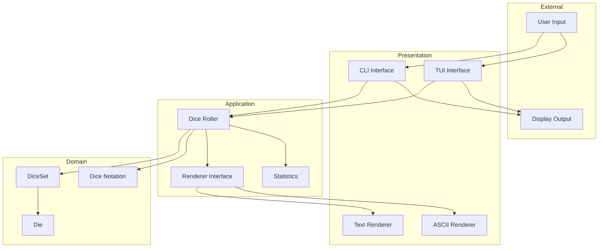

# System Architecture

## Overview
This dice simulation follows Clean Architecture principles to ensure:
- Separation of concerns between dice logic and display
- Testability through dependency injection
- Flexibility to change UI or add new features
- Clear dependency flow from UI to domain

## Architecture Layers

### Domain Layer (Inner Core)
The heart of the application, containing the dice simulation logic:
- **Die**: Represents a single die with configurable sides
- **DiceSet**: Manages multiple dice as a collection
- **DiceNotation**: Parses standard dice notation (e.g., "3d6+2")

### Application Layer
Coordinates between the domain and presentation layers:
- **DiceRoller**: Orchestrates dice rolling operations
- **Renderer**: Abstract interface for different display strategies

### Presentation Layer (Outer Layer)
User interfaces that interact with the dice system:
- **CLI**: Command-line interface for terminal interaction
- **TUI**: Terminal UI with visual dice representation using a 3rd party library
(optional)
- **TextRenderer**: Simple text output
- **JSONRenderer**: JSON format output

## Dependency Flow

## Key Design Principles

### 1. Dependency Injection
All dependencies are injected through constructors, making components:
- Testable with mocks
- Loosely coupled
- Configurable

### 2. Event-Driven Communication
Game events are emitted for:
- Dice rolls
- Game state transitions

### 3. Immutability
Game state is never directly modified from outside the domain.

### 4. Interface Segregation
Clear interfaces define contracts between layers.

## Data Flow Example
1. User enters "roll 3d6+2" in CLI
2. CLI parses command and calls DiceRoller.roll("3d6+2")
3. DiceRoller uses DiceNotation to parse the string
4. DiceNotation returns configuration: 3 dice, 6 sides each, modifier +2
5. DiceRoller creates/uses DiceSet with 3 d6 dice
6. DiceSet calls roll() on each Die instance
7. Each Die generates a random number 1-6
8. DiceSet collects results [4, 2, 6]
9. DiceRoller adds modifier: 4+2+6+2 = 14
10. DiceRoller updates Statistics with the result
11. DiceRoller uses injected Renderer to format output
12. Result flows back to CLI
13. CLI displays formatted result to user

## Testing Strategy
Each layer should be testable independently:
- **Domain**: Pure unit tests with no external dependencies
- **Application**: Tests with mocked domain objects
- **Presentation**: Tests with mocked application layer
## Future Enhancements
The architecture should be reasonable to support future additions:
- Web interface
- Themes
- Internationalization (i18n)
- Analytics and reporting